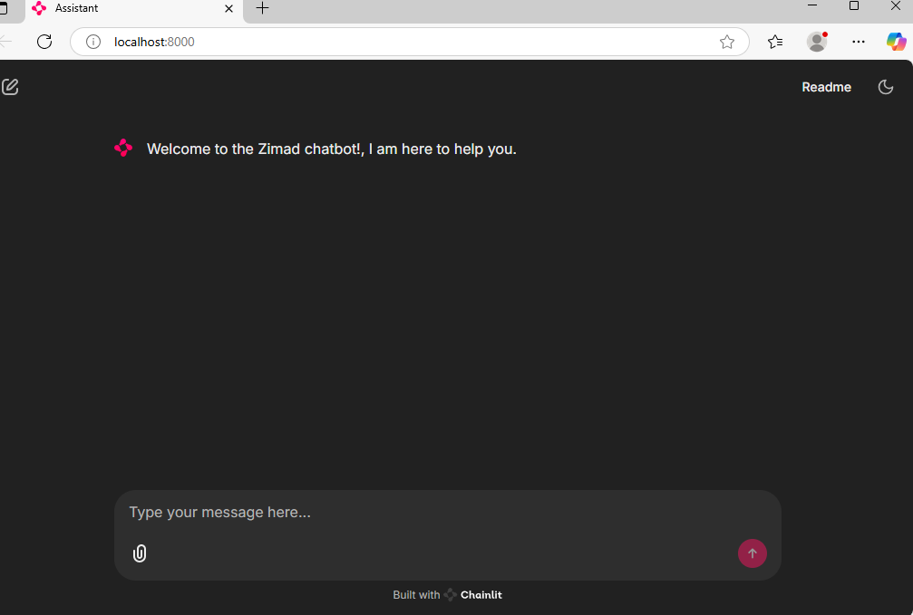

# 🤖 Chatbots

A Python-based AI chatbot application built with **Chainlit**, the **OpenAI Agents SDK**, and the **Google Gemini API** through an OpenAI-compatible interface.

The project provides a simple conversational interface where users can interact with an AI agent while maintaining conversation history during the chat session.



---

## 📌 Overview

**Chatbots** is an AI-powered conversational application designed to demonstrate how to build an interactive chatbot using modern Python AI tooling.

The application uses:

* **Chainlit** for the web-based chat interface
* **OpenAI Agents SDK** for agent creation and execution
* **Google Gemini** as the underlying language model
* **AsyncOpenAI** for communicating with the Gemini OpenAI-compatible API
* **Environment variables** for securely managing API credentials
* **JSON** for storing conversation history

The current chatbot is configured to act as a helpful assistant that provides concise, single-sentence answers.

---

## ✨ Features

* 💬 Interactive web-based chatbot UI
* 🤖 AI agent powered by the OpenAI Agents SDK
* 🧠 Google Gemini model integration
* 🔐 Environment-variable based API configuration
* 📝 Conversation history maintained during a session
* 💾 Chat history exported to a JSON file when the chat ends
* ⚡ Asynchronous Chainlit event handlers
* 🛡️ Error handling for failed AI requests
* 📦 Modern Python project configuration using `pyproject.toml`
* 🔒 Git-friendly secret management through `.env`

---

## 🛠️ Tech Stack

| Technology                 | Purpose                                      |
| -------------------------- | -------------------------------------------- |
| **Python 3.13+**           | Programming language                         |
| **Chainlit**               | Chat application UI                          |
| **OpenAI Agents SDK**      | AI agent framework                           |
| **Google Gemini API**      | Language model provider                      |
| **AsyncOpenAI**            | API client                                   |
| **python-dotenv / dotenv** | Environment variable loading                 |
| **Rich**                   | Terminal error/status output                 |
| **JSON**                   | Chat history storage                         |
| **uv**                     | Python dependency and environment management |

---

## 📂 Project Structure

```text
Chatbots/
│
├── Browser-screenshot.png
├── README.md
│
└── chatbot1/
    │
    ├── README.md
    ├── chainlit.md
    ├── chat_history.json
    ├── pyproject.toml
    ├── uv.lock
    │
    └── src/
        └── chatbot1/
            ├── __init__.py
            ├── chatbot.py
            └── my_secret.py
```

### Important Files

#### `chatbot.py`

Contains the main chatbot implementation.

It is responsible for:

* Starting the Chainlit chat session
* Creating the AI agent
* Configuring the Gemini API client
* Receiving user messages
* Maintaining conversation history
* Running the agent
* Returning the AI response
* Saving chat history when the session ends

#### `my_secret.py`

Handles environment variables required by the application.

The application expects:

```text
GEMINI_API_KEY
GEMINI_API_URL
GEMINI_API_MODEL
```

#### `pyproject.toml`

Defines the Python project metadata, Python version requirement, dependencies, and build configuration.

#### `uv.lock`

Locks the project's dependency versions to provide more reproducible installations.

#### `chainlit.md`

Controls the Chainlit welcome screen and introductory content.

#### `chat_history.json`

Stores the conversation history written when a chat session ends.

---

# 🚀 Getting Started

## Prerequisites

Before running the project, make sure you have:

* **Python 3.13 or newer**
* A valid **Google Gemini API key**
* `uv` installed on your system

You can verify Python with:

```bash
python --version
```

The project requires:

```text
Python >= 3.13
```

---

## 📥 Installation

---

### 1. Create the environment

If you are using `uv`, create the project environment with:

```bash
uv sync
```

Because the repository contains a `uv.lock` file, `uv` can use the locked dependency versions when installing the project environment.

---

## 🔐 Environment Variables

The application requires three environment variables.

Create a `.env` file inside the `chatbot1` directory:

```text
GEMINI_API_KEY=your_gemini_api_key
GEMINI_API_URL=your_gemini_api_url
GEMINI_API_MODEL=your_gemini_model
```

### Example

```text
GEMINI_API_KEY=your-api-key-here
GEMINI_API_URL=your-api-url-here
GEMINI_API_MODEL=your-model-name-here
```

> **Important:** Never commit your real API key to GitHub.

Your `.env` file should be added to `.gitignore`:

```gitignore
.env
```

---

# ▶️ Running the Application

From inside the `chatbot1` directory, run:

```bash
uv run chainlit run src/chatbot1/chatbot.py -w
```

The `-w` option enables automatic reload while developing.

After starting the application, Chainlit will provide a local URL that you can open in your browser.

---

## 💬 How It Works

The application follows a simple agent-based workflow:

```text
User
 │
 ▼
Chainlit Web Interface
 │
 ▼
chatbot.py
 │
 ▼
AI Agent
 │
 ▼
OpenAI-Compatible Client
 │
 ▼
Google Gemini API
 │
 ▼
AI Response
 │
 ▼
Chainlit UI
```

---

## 🧠 Agent Configuration

The chatbot creates an agent with the following behavior:

```text
You are a helpful assistant.
Which can precisely answer questions in a single sentence.
```

The agent is initialized when a new Chainlit chat session starts.

The configured Gemini model is loaded from:

```text
GEMINI_API_MODEL
```

The Gemini API URL is loaded from:

```text
GEMINI_API_URL
```

And the API key is loaded from:

```text
GEMINI_API_KEY
```

---


# 📸 Screenshot

The repository includes a screenshot demonstrating the chatbot interface.


---

# 👨‍💻 Author

**Muhammad Zimad**

Data Analyst | AI Agent & Chatbot Developer | Python & Workflow-Automation

* GitHub: [Muhammad-zimad](https://github.com/Muhammad-zimad)

---

## ⭐ Support

If you find this project useful, consider giving the repository a ⭐ on GitHub.

---

> Built with Python, Chainlit, OpenAI Agents SDK, and Google Gemini.
